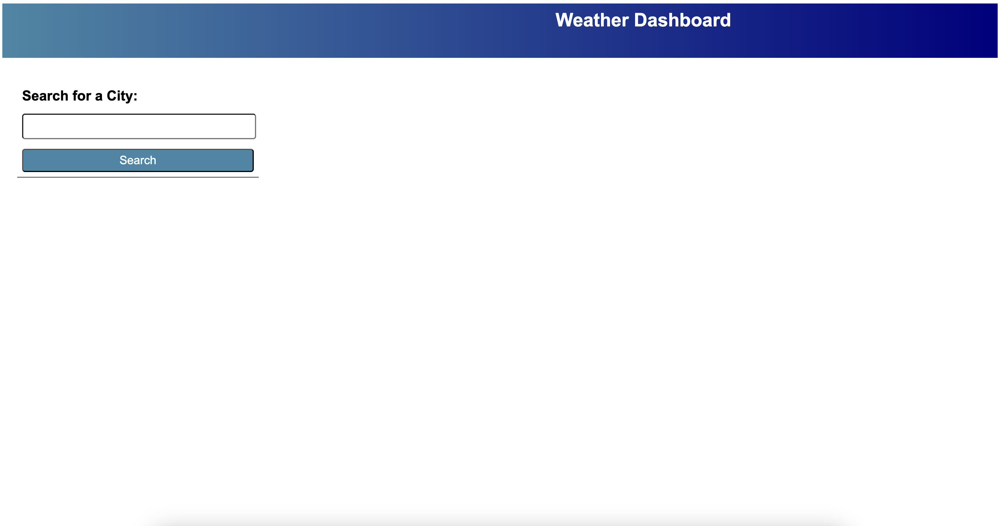
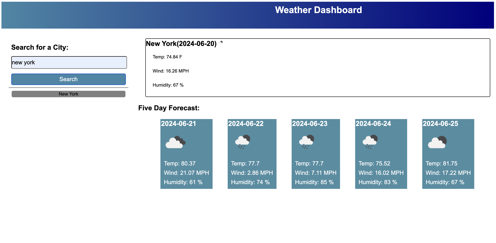
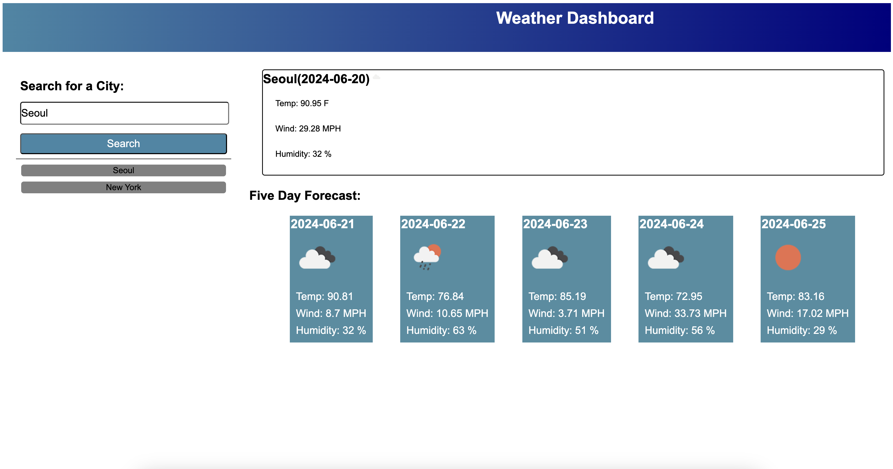

### Weather forecast board

## Link to application
https://jonghobae0218.github.io/weather_dashboard/

## Description
This is a weather board to get weather information of 5 days.

Below is the default screen

It provides 
1. Date, Weather Icon, Temperature, Wind speed, and Humidity.

2. It adds searhed city on the left, new ones on the top

3. When clicking the history, it displays that city's weather

